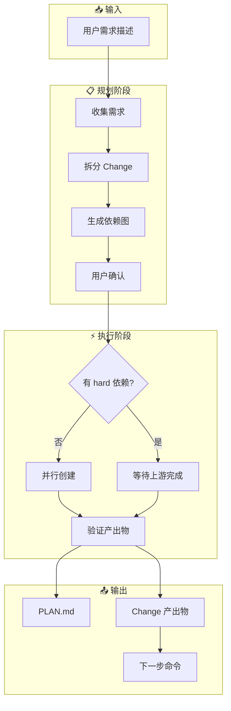
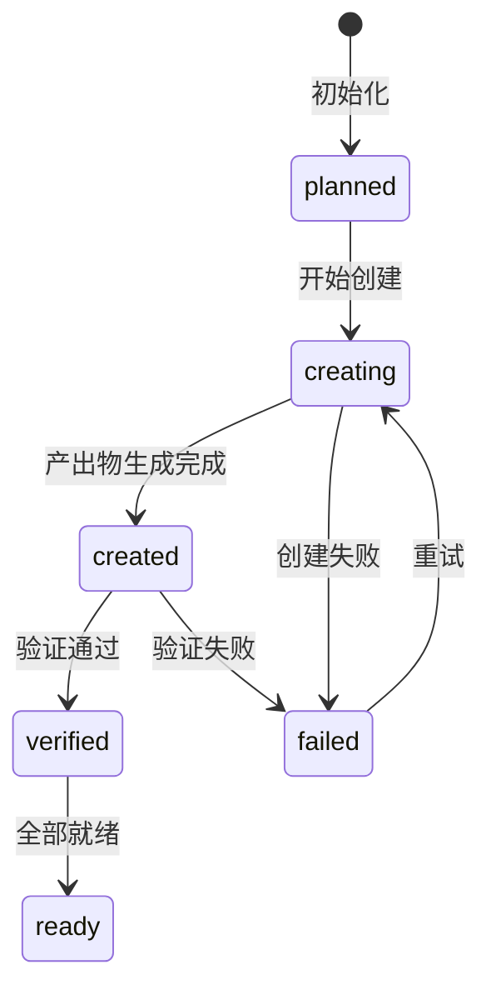
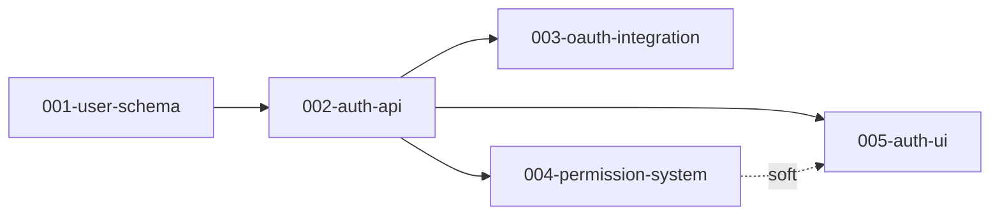

<div align="center">

# 🧩 OpenSpec Planner

**将大型需求智能拆解为可独立推进的 Change**

[](https://github.com/413889948/openspec-plan-skill)
[](LICENSE)
[](https://github.com/anthropics/anthropic-quickstarts)
[](https://opencode.ai)

*规划 · 委托 · 验证 — 让复杂需求变得可控*

</div>

---

## ✨ 核心特性

| 特性 | 描述 |
|------|------|
| 🔀 **智能拆分** | 自动将大型需求拆分为 ≤8 个独立 Change，每个单一职责 |
| 📊 **依赖管理** | 区分 hard/soft 依赖，生成 DAG 依赖图 |
| 🔄 **并行执行** | 无依赖的 Change 可并行创建，加速产出 |
| ✅ **强制验证** | 每个产出物必须通过验证才能进入下一步 |
| 📝 **状态追踪** | 实时追踪 `planned → creating → verified → ready` 状态流 |

---

## 🎯 适用场景

> [!TIP]
> 当你发现自己在问"这个需求怎么下手？"时，就该用这个 skill 了！

| 场景 | 示例 |
|------|------|
| 🏗️ **跨模块需求** | "重构整个用户认证系统" |
| 📦 **多阶段交付** | "从零搭建数据分析平台" |
| 🔗 **复杂依赖** | "实现微服务架构迁移" |
| 🧠 **防止上下文溢出** | 单个 Change 预计超过 8 个 tasks |

---

## 🚀 快速开始

### 安装

```bash
# 克隆到 OpenCode skills 目录
git clone https://github.com/413889948/openspec-plan-skill.git \
  ~/.config/opencode/skills/openspec-plan
```

### 使用

在 OpenCode 中直接描述需求：

```
我需要一个完整的用户认证系统，包括注册、登录、JWT、OAuth 和权限管理。
```

Skill 会自动：
1. 分析需求并拆分为多个 Change
2. 生成依赖图和执行计划
3. 等待你确认后开始创建产出物

---

## 📊 工作流程



---

## 🔄 Change 状态流转

每个 Change 经历以下状态：



| 状态 | 含义 |
|------|------|
| `planned` | 已规划，等待创建 |
| `creating` | 正在生成产出物 |
| `created` | 产出物已生成 |
| `verified` | 验证通过 |
| `ready` | 可执行 |
| `failed` | 失败（需重试） |

---

## 📁 输出示例

### PLAN.md 结构

```markdown
# Plan: 用户认证系统

**日期**: 2025-03-18
**需求数量**: 5 个 Change

## Change 清单

| 编号 | 名称 | 目标 | Hard | Soft | 状态 |
|------|------|------|------|------|------|
| 001 | user-schema | 定义用户数据模型 | - | - | ready |
| 002 | auth-api | 实现认证 API | 001 | - | verified |
| 003 | oauth-integration | OAuth 集成 | 002 | - | planned |
| 004 | permission-system | 权限管理 | 002 | - | planned |
| 005 | auth-ui | 认证界面 | 002 | 004 | planned |

## 依赖图

[001-user-schema] --hard--> [002-auth-api]
[002-auth-api] --hard--> [003-oauth-integration]
[002-auth-api] --hard--> [004-permission-system]
[002-auth-api] --hard--> [005-auth-ui]
[004-permission-system] --soft--> [005-auth-ui]
```

---

## 🧠 完整示例

<details>
<summary>📝 点击展开：用户认证系统拆分示例</summary>

**输入需求：**

> 我需要一个完整的用户认证系统，包括注册、登录、JWT、OAuth 和权限管理。

**输出拆分：**

```
001-user-schema      ← 数据层（无依赖）
002-auth-api         ← API 层（依赖 001）
003-oauth-integration ← OAuth 扩展（依赖 002）
004-permission-system ← 权限扩展（依赖 002）
005-auth-ui          ← 前端层（依赖 002，软依赖 004）
```

**依赖图：**



**执行顺序：**
1. 创建 `001-user-schema`（无依赖）
2. 并行创建 `002-auth-api`（依赖 001）
3. 等待 002 完成后，并行创建 `003`, `004`, `005`

</details>

---

## 🔗 相关 Skill 生态

| Skill | 用途 |
|-------|------|
| [`openspec-ff-change`](#) | 生成单个 Change 的产出物 |
| [`openspec-apply-change`](#) | 实现 Change 中的任务 |
| [`openspec-verify-change`](#) | 验证实现是否匹配产出物 |
| [`openspec-archive-change`](#) | 实现完成后归档 |

---

## ⚠️ 核心边界

> [!IMPORTANT]
> `openspec-plan` 只负责规划、委托、验证，**不直接生成产出物**

| ✅ 负责 | ❌ 不负责 |
|--------|----------|
| 需求分析和拆分 | 直接写 `proposal.md` |
| 生成依赖图 | 直接写 `specs/*.md` |
| 委托任务代理 | 实现 Change 代码 |
| 验证产出物完整性 | Best-effort 补写 |

---

## 🛡️ 安全护栏

<details>
<summary>🔒 点击展开：委托协议和验证规则</summary>

### 委托协议

每次 `task()` 委托必须包含：

```typescript
task(
  category="writing",
  load_skills=["openspec-ff-change"],
  prompt="""
  ## TASK
  创建 change 并完成所有 applyRequires
  
  ## ROLE
  你是该 change 的唯一执行者
  
  ## PLAN PATH
  openspec/plans/<plan-id>/PLAN.md
  
  ## CHANGE ID
  <change-name>
  
  ## DEPENDENCIES
  - hard: [...]
  - soft: [...]
  
  ## SUCCESS CRITERIA
  - CHANGE.md 存在且非空
  - proposal.md 存在且非空
  - applyRequires 全部 done
  """
)
```

### 验证规则

主 Agent 必须验证：
- ✅ `CHANGE.md` 存在且非空
- ✅ `proposal.md` 存在且非空
- ✅ `specs/**/*.md` 存在且非空
- ✅ `openspec-cn status --change "<name>" --json` 中 `applyRequires` 全部为 `done`
- ✅ 任务代理返回的文件列表与实际文件一致

</details>

---

## 📜 License

MIT License - 自由使用于个人或商业项目

---

<div align="center">

**Made with ❤️ for OpenSpec**

[⭐ Star this repo](https://github.com/413889948/openspec-plan-skill) if you find it useful!

</div>